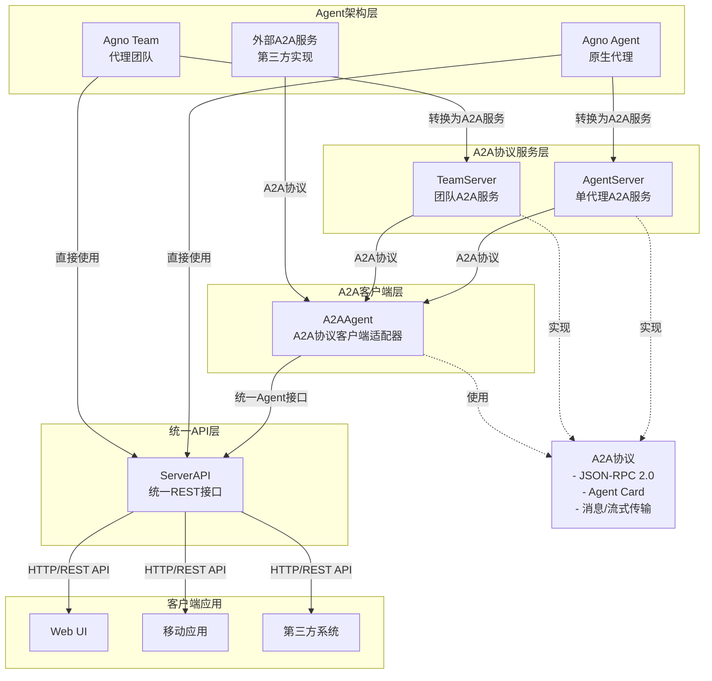

# AI-Agents 平台

一个强大的AI代理框架，用于构建、管理和部署智能代理应用。

## 项目简介

AI-Agents是一个综合性的代理开发平台，提供了完整的工具链和框架，支持创建单一代理和多代理团队，实现智能对话、任务处理和代理间协作。该平台集成了多种先进AI模型，并提供了丰富的工具集，使开发者能够快速构建复杂的AI应用。

## 技术栈

- **后端框架**：FastAPI
- **AI模型**：支持OpenAI、Anthropic Claude、Google Gemini、DeepSeek等多种模型
- **数据库**：MySQL、MongoDB、PostgreSQL、向量数据库(Milvus, Qdrant, pgvector)
- **通信协议**：gRPC, REST, WebSocket, A2A协议
- **前端**：React组件库
- **部署**：Docker容器化
- **工具集成**：支持网络搜索、文档处理、代码执行等多种工具

## 项目结构

```
ai-agents/
├── sdk/                    # SDK核心库
│   ├── a2a-python/         # A2A协议Python实现
│   │   ├── src/            # 源代码
│   │   │   ├── a2a/        # 核心库实现
│   │   │   │   ├── auth/   # 认证模块
│   │   │   │   ├── client/ # 客户端实现
│   │   │   │   ├── grpc/   # gRPC协议定义
│   │   │   │   ├── server/ # 服务器实现
│   │   │   │   └── utils/  # 工具函数
│   │   └── tests/          # 测试用例
│   └── agno/               # 核心代理框架
│       ├── agent/          # 代理模型定义
│       ├── team/           # 团队协作
│       ├── models/         # AI模型适配器
│       ├── tools/          # 工具集成
│       ├── memory/         # 记忆管理
│       ├── storage/        # 存储接口
│       ├── vectordb/       # 向量数据库
│       ├── workspace/      # 工作空间
│       ├── api/            # API接口
│       ├── cli/            # 命令行工具
│       ├── app/            # 应用框架
│       └── utils/          # 工具函数
├── apis/                   # API服务层
│   ├── migrations/         # 数据库迁移
│   ├── models/             # 数据模型
│   ├── playground/         # 代理测试环境
│   └── routers/            # API路由
│       ├── _async/         # 异步API路由
│       └── sync/           # 同步API路由
├── servers/                # 服务器实现
│   ├── agent.py            # 代理服务
│   ├── team.py             # 团队服务
│   ├── api.py              # API服务
│   ├── base.py             # 基础服务
│   ├── schemas.py          # 数据模式
│   └── utils.py            # 工具函数
├── agno_ext/               # agno扩展模块
│   ├── a2a/                # A2A协议扩展
│   │   ├── a2a_agent.py   # A2A代理适配器
│   │   └── a2a_team.py    # A2A团队适配器
│   ├── memory/             # 记忆扩展
│   ├── storage/            # 存储扩展
│   └── tools/              # 工具扩展
├── agent-ui/               # React前端界面
│   ├── src/                # 源代码
│   │   ├── api/            # API客户端
│   │   ├── app/            # 应用核心
│   │   ├── components/     # UI组件
│   │   │   ├── playground/ # 代理测试界面
│   │   │   └── ui/         # 通用UI组件
│   │   └── hooks/          # React钩子
│   └── package.json        # 依赖配置
├── web/                    # Vue前端界面
│   ├── src/                # 源代码
│   │   ├── api/            # API客户端
│   │   ├── components/     # UI组件
│   │   ├── views/          # 页面视图
│   │   └── utils/          # 工具函数
│   └── package.json        # 依赖配置
├── examples/               # 示例代码
│   ├── remote_agent1.py    # 单一代理服务示例
│   ├── remote_team.py      # 团队代理服务示例
│   ├── server_api.py       # 统一API服务示例
│   ├── test_a2a_agents.py  # A2A协议兼容性测试
│   ├── test_server_api.py  # API服务测试
│   ├── basic_agent.py      # 基础代理示例
│   ├── memory.py           # 记忆系统示例
│   ├── mcp_tools.py        # MCP工具集成示例
│   └── autel_team_test.py  # 特定业务场景示例
├── requirements.txt         # Python依赖
├── README.md               # 项目文档
└── 基于agno的AI-Agents框架.md # 技术文档
```

## 核心功能

### 1. 智能代理

- **单一代理**：支持创建独立的AI代理，具备对话理解和任务执行能力
- **代理团队**：支持多个代理协同工作，实现复杂任务分解和协作
- **记忆系统**：代理具备长期和短期记忆能力，支持上下文理解
- **工具使用**：代理可以使用各种工具执行实际任务，如网络搜索、数据处理等

### 2. 模型集成

- **多模型支持**：集成OpenAI、Claude、Gemini、DeepSeek等多种大型语言模型
- **模型切换**：可根据任务需求灵活切换不同的基础模型

### 3. 通信机制

- **A2A协议**：专为代理间通信设计的协议，支持结构化消息传递
- **gRPC接口**：高性能的代理通信接口，适用于分布式环境
- **REST API**：提供RESTful接口，方便集成到现有系统

### 4. 存储与记忆

- **多种数据库支持**：支持关系型数据库和向量数据库
- **结构化记忆**：支持不同类型的记忆存储和检索
- **向量搜索**：使用语义相似性搜索相关信息

### 5. 工具集成

- **网络搜索**：集成搜索引擎，获取实时信息
- **文档处理**：支持PDF、文本、网页等多种文档格式的处理
- **外部API调用**：支持调用外部API执行特定功能

### 6. 可视化界面

- **代理测试环境**：提供交互式界面测试和调试代理功能
- **会话管理**：支持多会话管理，查看历史对话
- **工具调用可视化**：展示代理工具调用过程和结果

## 系统架构

AI-Agents平台采用多层架构设计，通过标准化协议实现组件间的灵活组合和互操作。

### 架构图



### 架构层级

1. **Agent架构层**：基础代理实现，包括原生Agno代理、代理团队和外部A2A服务
2. **A2A协议服务层**：将代理转换为A2A协议服务
3. **A2A客户端层**：连接和使用A2A协议服务的适配器
4. **统一API层**：提供统一的HTTP REST API接口
5. **客户端应用层**：各类使用代理服务的应用

## 核心组件详解

### 1. Agent组件

#### 1.1 Agno Agent

原生智能代理实现，支持与LLM模型交互、工具调用、记忆管理等功能。

**核心特性**：
- 多模型支持
- 工具调用能力
- 记忆系统
- 会话管理

**示例代码**：

```python
from agno.agent.agent import Agent
from agno.models.openai import OpenAIChat

# 创建代理实例
agent = Agent(
    name="MyAgent",
    role="Assistant",
    model=OpenAIChat(id="gpt-4o"),
    tools=[...],  # 添加所需工具
    instructions="Your instructions here",
)

# 运行代理
response = await agent.arun("你好，请介绍一下你自己")
```

#### 1.2 Agno Team

代理团队实现，支持多个代理协同工作。

**核心特性**：
- 多代理协同
- 团队协调
- 任务分配
- 结果合并

**示例代码**：

```python
from agno.team.team import Team

# 创建团队实例
team = Team(
    name="MyTeam",
    members=[agent1, agent2],  # 添加团队成员
    model=OpenAIChat(id="gpt-4o"),
    instructions=["Team instructions"],
)

# 运行团队
team_response = await team.arun("请团队协作解决这个问题...")
```

### 2. A2A协议层组件

#### 2.1 AgentServer

将原生Agno Agent转换为A2A协议服务。

**功能**：
- 提供A2A协议端点
- 生成Agent Card
- 处理标准和流式请求
- 管理代理生命周期

**示例代码**：

```python
from servers.agent import AgentServer

# 创建代理服务器
agent_server = AgentServer(agent=my_agent, port=8000)

# 启动服务
await agent_server.start()
```

#### 2.2 TeamServer

将Agno Team转换为A2A协议服务。

**功能**：
- 提供统一A2A接口
- 处理团队协作请求
- 管理团队成员通信

**示例代码**：

```python
from servers.team import TeamServer

# 创建团队服务器
team_server = TeamServer(team=my_team, port=9000)

# 启动服务
await team_server.start()
```

### 3. A2A客户端层

#### 3.1 A2AClient

标准A2A协议客户端，用于与A2A服务进行通信。

**功能**：
- 连接到A2A服务
- 获取Agent Card
- 发送消息和接收响应
- 支持流式通信

**示例代码**：

```python
import httpx
from a2a.client import A2AClient
from a2a.types import SendMessageRequest, MessageSendParams

async with httpx.AsyncClient() as httpx_client:
    # 连接到远程代理
    client = await A2AClient.get_client_from_agent_card_url(
        httpx_client, "http://localhost:8000"
    )
    
    # 发送消息
    request = SendMessageRequest(
        id="request-id",
        params=MessageSendParams(
            message={
                "role": "user",
                "parts": [{"type": "text", "text": "你好"}],
                "messageId": "message-id"
            }
        )
    )
    
    # 获取响应
    response = await client.send_message(request)
```

#### 3.2 A2AAgent

将A2A服务转换回Agent接口的适配器。

**功能**：
- 封装A2A通信细节
- 提供标准Agent接口
- 处理异步和流式响应

**示例代码**：

```python
from agents.agno_ext import A2AAgent

# 创建A2A代理
remote_agent = A2AAgent(
   base_url="http://localhost:8000",
   name="RemoteAgent",
   role="远程助手"
)

# 使用标准Agent接口
response = await remote_agent.arun("你好")
```

### 4. 统一API层

#### 4.1 ServerAPI

为所有代理类型提供统一的REST API接口。

**功能**：
- 统一HTTP端点
- 代理管理
- 会话处理
- 认证与授权

**示例代码**：

```python
from servers.api import ServerAPI

# 创建API服务
server_api = ServerAPI(
    agents=[agent1, remote_agent],
    teams=[team1],
    port=8080
)

# 启动API服务
await server_api.start()
```

## A2A协议规范

A2A（Agent-to-Agent）协议是一个基于JSON-RPC 2.0的通信标准，用于代理之间的互操作。

### 协议组成

1. **Agent Card**：代理能力描述
2. **消息格式**：请求和响应结构
3. **流式通信**：实时数据流规范

### Agent Card结构

Agent Card是代理的元数据描述，包含以下关键信息：

```json
{
  "name": "代理名称",
  "description": "代理描述",
  "url": "代理服务URL",
  "version": "协议版本",
  "defaultInputModes": ["text"],
  "defaultOutputModes": ["text"],
  "capabilities": { ... },
  "skills": [ ... ]
}
```

### 请求格式

基于JSON-RPC 2.0，A2A请求格式如下：

```json
{
  "id": "请求唯一ID",
  "jsonrpc": "2.0",
  "method": "message/send",
  "params": {
    "message": {
      "role": "user",
      "parts": [
        {
          "type": "text",
          "text": "消息内容"
        }
      ],
      "messageId": "消息ID"
    },
    "configuration": { ... },
    "metadata": { ... }
  }
}
```

### 响应格式

标准响应格式：

```json
{
  "id": "请求ID",
  "jsonrpc": "2.0",
  "result": {
    "kind": "message",
    "parts": [
      {
        "kind": "text",
        "text": "响应内容"
      }
    ],
    "role": "agent",
    "messageId": "响应消息ID"
  }
}
```

## Examples目录功能说明

`examples/` 目录包含了各种示例代码，展示了AI-Agents平台的不同使用场景和功能。

### 核心示例文件

#### 1. `remote_agent1.py` - 单一代理服务示例
**功能**：演示如何创建和启动一个基于A2A协议的单一代理服务
- 创建搜索代理（SearchAgent）
- 配置工具和模型
- 启动AgentServer服务
- 提供A2A协议端点

#### 2. `remote_team.py` - 团队代理服务示例
**功能**：演示如何创建和启动一个基于A2A协议的团队代理服务
- 创建包含多个代理的团队
- 配置团队协作模式
- 启动TeamServer服务
- 提供统一的A2A团队接口

#### 3. `server_api.py` - 统一API服务示例
**功能**：演示如何创建统一的REST API服务
- 集成多种类型的代理（本地代理、远程A2A代理、团队）
- 提供统一的HTTP REST接口
- 支持代理管理和会话处理
- 提供流式响应支持

#### 4. `test_a2a_agents.py` - A2A协议兼容性测试
**功能**：测试A2AAgent的功能和A2A协议兼容性
- 测试远程代理连接
- 测试团队协作功能
- 测试流式通信
- 测试错误处理机制
- 验证A2A协议标准兼容性

#### 5. `test_server_api.py` - API服务测试
**功能**：测试ServerAPI的HTTP接口功能
- 测试代理运行接口
- 测试团队运行接口
- 测试流式响应接口
- 测试错误处理和参数验证

### 其他示例文件

#### 6. `basic_agent.py` - 基础代理示例
**功能**：演示如何创建和使用基础的Agno代理
- 简单的代理创建和使用
- 基本的对话功能
- 工具集成示例

#### 7. `memory.py` - 记忆系统示例
**功能**：演示代理的记忆功能
- 长期记忆管理
- 短期记忆处理
- 记忆检索和更新

#### 8. `mcp_tools.py` - MCP工具集成示例
**功能**：演示如何集成Model Context Protocol工具
- MCP工具连接
- 工具调用示例
- 团队中使用MCP工具

#### 9. `autel_team_test.py` - 特定业务场景示例
**功能**：演示特定业务场景下的代理团队使用
- 企业信息查询
- 多代理协作分析
- 业务数据整合

### 测试和验证文件

#### 10. `client.py` - A2A客户端测试
**功能**：独立的A2A协议客户端测试工具
- 连接远程A2A服务
- 发送测试消息
- 验证协议兼容性

#### 11. `a2a_agents.py` - A2A代理集成测试
**功能**：测试A2AAgent与agno框架的集成
- 验证A2AAgent作为agno代理的使用
- 测试团队中的A2AAgent协作
- 验证协议转换的正确性

## 使用示例

### 1. 创建A2A服务

#### 1.1 搜索代理服务

```python
# 创建搜索代理
search_agent = Agent(
    name="SearchAgent",
    role="搜索专家",
    agent_id="search",
    tools=[Searxng(host="http://search.example.com")],
    model=OpenAIChat(id="gpt-4o")
)

# 创建并启动服务
search_server = AgentServer(agent=search_agent, port=8000)
await search_server.start()
```

#### 1.2 代理团队服务

```python
# 创建本地团队
local_team = Team(
    name="本地团队",
    members=[agent1, agent2, agent3],
    mode="coordinate",
    model=model,
    team_id="team-uuid"
)

# 创建并启动团队服务
team_server = TeamServer(team=local_team, port=9000)
await team_server.start()
```

### 2. 使用A2A服务

#### 2.1 直接使用A2AClient

```python
async with httpx.AsyncClient() as httpx_client:
    # 连接到远程代理
    client = await A2AClient.get_client_from_agent_card_url(
        httpx_client, "http://localhost:8000"
    )
    
    # 发送消息
    request = SendMessageRequest(
        id=uuid4().hex,
        params=MessageSendParams(
            message={
                "role": "user",
                "parts": [{"type": "text", "text": "查询今天的天气"}],
                "messageId": uuid4().hex
            }
        )
    )
    
    # 获取响应
    response = await client.send_message(request)
    print(response.model_dump(mode="json", exclude_none=True))
```

#### 2.2 使用A2AAgent封装

```python
# 创建远程代理适配器
remote_agent = A2AAgent(
    base_url="http://localhost:8000",
    name="RemoteSearchAgent",
    role="远程搜索代理"
)

# 使用标准Agent接口
response = await remote_agent.arun("查询北京今天的天气")
print(f"代理回复: {response.message}")

# 流式响应
stream_response = await remote_agent.arun("详细介绍深圳的天气", stream=True)
async for chunk in stream_response:
    if chunk.message:
        print(chunk.message, end="", flush=True)
```

#### 2.3 创建混合团队

```python
# 创建远程代理适配器
remote_search_agent = A2AAgent(
    base_url="http://localhost:8000",
    name="RemoteSearchAgent",
    role="远程搜索代理"
)

remote_analysis_agent = A2AAgent(
    base_url="http://localhost:8001",
    name="RemoteAnalysisAgent",
    role="远程分析代理"
)

# 创建本地代理
local_agent = Agent(
    name="LocalAgent",
    role="本地协调者",
    model=model
)

# 组建混合团队
hybrid_team = Team(
    name="混合团队",
    members=[local_agent, remote_search_agent, remote_analysis_agent],
    mode="coordinate",
    model=model
)

# 运行团队任务
team_response = await hybrid_team.arun("分析最近的经济数据")
```

## 快速开始

### 环境配置

1. 复制环境变量模板
```bash
cp env.example .env
```

2. 配置数据库和API密钥
```
# 编辑.env文件设置数据库连接和API密钥
```

3. 创建虚拟环境并安装依赖
```bash
conda create -n ai python=3.10
conda activate ai
pip install -r requirements.txt
```

### 初始化数据库

```bash
make migrate
```

### 启动服务

```bash
# 启动主服务
python main.py

# 启动单一代理服务
python agent_main.py
```

### 使用代理客户端

```python
from a2a.client import A2AClient
import httpx

async def main():
    async with httpx.AsyncClient() as client:
        a2a_client = await A2AClient.get_client_from_agent_card_url(
            client, "http://localhost:9999"
        )
        # 向代理发送消息
        response = await a2a_client.send_message(request)
        print(response)

if __name__ == "__main__":
    import asyncio
    asyncio.run(main())
```

## 测试与验证

### A2A协议兼容性测试

使用A2A客户端测试代理服务的协议兼容性：

```python
# 测试代理服务
agent_success = await test_remote_agent("http://localhost:8000")

# 测试流式通信
await test_streaming("http://localhost:8000")

# 测试团队服务
team_success = await test_remote_team("http://localhost:9000")
```

### 命令行测试工具

提供命令行测试工具，支持以下参数：

```bash
python examples/test_a2a_server.py --agent-url http://localhost:8000 --team-url http://localhost:9000 --timeout 60 --no-streaming
```

参数说明：
- `--agent-url`：代理服务URL
- `--team-url`：团队服务URL
- `--timeout`：请求超时时间（秒）
- `--no-streaming`：跳过流式测试
- `--skip-team`：跳过团队测试

### 测试结果与问题排查

通过运行标准测试脚本，我们发现了以下特征和问题：

#### 单一代理测试

✅ **单一代理测试成功**
- 能够成功获取代理卡片
- 正常通信测试成功，能够回复标准问题
- 流式通信测试成功，能够获得连续的响应数据

#### 团队代理测试

❌ **团队代理测试失败**
- 能够成功获取代理卡片
- 发送消息时出现超时错误
- 错误类型：`HTTP Error 503: Network communication error`
- 详细错误：`httpcore.ReadTimeout`

#### 常见问题与解决方案

1. **团队响应超时**
   - **问题**：团队处理需要更长时间，默认超时设置不足
   - **解决方案**：增加超时设置，使用`--timeout 60`或更高值

2. **协议版本不匹配**
   - **问题**：客户端与服务端A2A协议版本不兼容
   - **解决方案**：确保使用相同版本的`a2a-python`库

3. **并发请求限制**
   - **问题**：团队服务同时处理多个代理请求可能导致资源竞争
   - **解决方案**：调整并发设置，设置合理的`max_connections`参数

4. **模型API调用失败**
   - **问题**：团队中的某个代理无法成功调用底层AI模型API
   - **解决方案**：检查API密钥、网络连接和调用限制

5. **内存和资源限制**
   - **问题**：复杂团队处理可能占用大量内存
   - **解决方案**：增加服务器资源，或优化团队处理逻辑

## 数据库迁移

项目使用Alembic管理数据库结构的版本控制。常用命令：

```bash
# 执行所有待应用的迁移
make migrate

# 查看迁移状态
make migrate-status

# 创建新的迁移文件
make migrate-create name="添加用户表"
```

## 开发指南

开发的执行环境 conda env=ai

### 创建新代理

```python
from ai_agent.agent.agent import Agent
from ai_agent.models.openai import OpenAIChat

# 创建代理实例
agent = Agent(
    name="My Agent",
    role="Assistant",
    model=OpenAIChat(id="gpt-4o"),
    tools=[...],  # 添加所需工具
    instructions="Your instructions here",
)
```

### 创建代理团队

```python
from ai_agent.team import Team

# 创建团队实例
team = Team(
    name="My Team",
    members=[agent1, agent2],  # 添加团队成员
    model=OpenAIChat(id="gpt-4o"),
    instructions=["Team instructions"],
)
```

## 部署指南

### 环境配置

1. 复制环境变量模板

```bash
cp env.example .env
```

2. 配置必要的API密钥和数据库连接

```
# 编辑.env文件
OPENAI_API_KEY=your_key_here
DATABASE_URL=your_db_url_here
```

3. 创建虚拟环境并安装依赖

```bash
conda create -n ai python=3.10
conda activate ai
pip install -r requirements.txt
```

### 服务启动

#### 启动单一代理服务

```bash
python examples/remote_agent1.py
```

#### 启动团队服务

```bash
python examples/remote_team.py
```

#### 启动API服务

```bash
python examples/server_api.py
```

### Docker部署

提供Docker容器化部署支持：

```bash
# 构建镜像
docker build -t ai-agents .

# 运行容器
docker run -p 8000:8000 -p 8080:8080 --env-file .env ai-agents
```

## 扩展开发

### 添加新工具

1. 在 `agno/tools/` 目录下创建新的工具类
2. 实现工具接口方法
3. 注册工具到代理

```python
from agno.tools.base import BaseTool

class MyTool(BaseTool):
    name = "my_tool"
    description = "这是我的自定义工具"
    
    async def _arun(self, query: str) -> str:
        # 实现工具逻辑
        return f"处理查询: {query}"
```

### 添加新模型支持

1. 在 `agno/models/` 目录下创建新的模型适配器
2. 实现模型接口

```python
from agno.models.base import BaseModel

class MyModel(BaseModel):
    def __init__(self, id: str, **kwargs):
        super().__init__(id=id, **kwargs)
    
    async def acomplete(self, prompt: str, **kwargs):
        # 实现模型调用
        return "模型响应"
```

## 技术栈总结

AI-Agents平台基于以下核心技术构建：

- **后端框架**：FastAPI
- **AI模型**：OpenAI GPT系列、Anthropic Claude、Google Gemini等
- **通信协议**：A2A协议（基于JSON-RPC 2.0）、HTTP REST API
- **数据存储**：支持MySQL、MongoDB、向量数据库(Milvus, Qdrant)等
- **部署**：支持本地部署、Docker容器化、Kubernetes集群等

## 贡献指南

欢迎贡献代码、报告问题或提出新功能建议。请遵循以下步骤：

1. Fork本项目
2. 创建功能分支 (`git checkout -b feature/amazing-feature`)
3. 提交更改 (`git commit -m 'Add some amazing feature'`)
4. 推送到分支 (`git push origin feature/amazing-feature`)
5. 创建Pull Request

## 参考资源

- [A2A协议规范文档](https://github.com/a2a-protocol/a2a-specification)
- [FastAPI官方文档](https://fastapi.tiangolo.com/)
- [OpenAI API参考](https://platform.openai.com/docs/api-reference)
- [项目GitHub仓库](https://github.com/yourusername/ai-agents)

## 许可证

[此处填写项目许可证信息]

---

文档版本: v1.0
更新日期: 2023年8月1日 