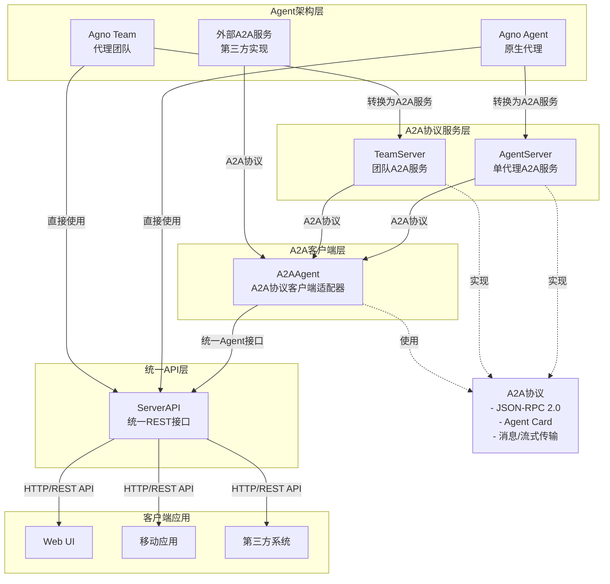

# 基于agno的AI-Agents框架技术文档

## 1. 项目概述

AI-Agents是一个强大的AI代理框架，基于agno核心库开发，用于构建、管理和部署智能代理应用。该平台提供了完整的工具链和框架，支持创建单一代理和多代理团队，实现智能对话、任务处理和代理间协作。

### 1.1 核心特性

- **多模型支持**：集成OpenAI、Claude、Gemini、DeepSeek等多种大型语言模型
- **代理协作**：支持多代理团队协同工作，实现复杂任务分解和协作
- **A2A协议**：标准化的Agent-to-Agent通信协议，实现跨平台代理互操作
- **工具扩展**：丰富的工具集成，支持搜索、文档处理、代码执行等多种能力
- **多种部署方式**：支持本地运行、服务化部署、容器化部署等多种方式

## 2. 系统架构

AI-Agents平台采用多层架构设计，通过标准化协议实现组件间的灵活组合和互操作。

### 2.1 架构图



### 2.2 架构层级

1. **Agent架构层**：基础代理实现，包括原生Agno代理、代理团队和外部A2A服务
2. **A2A协议服务层**：将代理转换为A2A协议服务
3. **A2A客户端层**：连接和使用A2A协议服务的适配器
4. **统一API层**：提供统一的HTTP REST API接口
5. **客户端应用层**：各类使用代理服务的应用

## 3. 核心组件详解

### 3.1 Agent组件

#### 3.1.1 Agno Agent

原生智能代理实现，支持与LLM模型交互、工具调用、记忆管理等功能。

**核心特性**：
- 多模型支持
- 工具调用能力
- 记忆系统
- 会话管理

**示例代码**：

```python
from agno.agent.agent import Agent
from agno.models.openai import OpenAIChat

# 创建代理实例
agent = Agent(
    name="MyAgent",
    role="Assistant",
    model=OpenAIChat(id="gpt-4o"),
    tools=[...],  # 添加所需工具
    instructions="Your instructions here",
)

# 运行代理
response = await agent.arun("你好，请介绍一下你自己")
```

#### 3.1.2 Agno Team

代理团队实现，支持多个代理协同工作。

**核心特性**：
- 多代理协同
- 团队协调
- 任务分配
- 结果合并

**示例代码**：

```python
from agno.team.team import Team

# 创建团队实例
team = Team(
    name="MyTeam",
    members=[agent1, agent2],  # 添加团队成员
    model=OpenAIChat(id="gpt-4o"),
    instructions=["Team instructions"],
)

# 运行团队
team_response = await team.arun("请团队协作解决这个问题...")
```

### 3.2 A2A协议层组件

#### 3.2.1 AgentServer

将原生Agno Agent转换为A2A协议服务。

**功能**：
- 提供A2A协议端点
- 生成Agent Card
- 处理标准和流式请求
- 管理代理生命周期

**示例代码**：

```python
from servers.agent import AgentServer

# 创建代理服务器
agent_server = AgentServer(agent=my_agent, port=8000)

# 启动服务
await agent_server.start()
```

#### 3.2.2 TeamServer

将Agno Team转换为A2A协议服务。

**功能**：
- 提供统一A2A接口
- 处理团队协作请求
- 管理团队成员通信

**示例代码**：

```python
from servers.team import TeamServer

# 创建团队服务器
team_server = TeamServer(team=my_team, port=9000)

# 启动服务
await team_server.start()
```

### 3.3 A2A客户端层

#### 3.3.1 A2AClient

标准A2A协议客户端，用于与A2A服务进行通信。

**功能**：
- 连接到A2A服务
- 获取Agent Card
- 发送消息和接收响应
- 支持流式通信

**示例代码**：

```python
import httpx
from a2a.client import A2AClient
from a2a.types import SendMessageRequest, MessageSendParams

async with httpx.AsyncClient() as httpx_client:
    # 连接到远程代理
    client = await A2AClient.get_client_from_agent_card_url(
        httpx_client, "http://localhost:8000"
    )
    
    # 发送消息
    request = SendMessageRequest(
        id="request-id",
        params=MessageSendParams(
            message={
                "role": "user",
                "parts": [{"type": "text", "text": "你好"}],
                "messageId": "message-id"
            }
        )
    )
    
    # 获取响应
    response = await client.send_message(request)
```

#### 3.3.2 A2AAgent

将A2A服务转换回Agent接口的适配器。

**功能**：
- 封装A2A通信细节
- 提供标准Agent接口
- 处理异步和流式响应

**示例代码**：

```python
from agno_a2a_ext.agent import A2AAgent

# 创建A2A代理
remote_agent = A2AAgent(
    base_url="http://localhost:8000",
    name="RemoteAgent",
    role="远程助手"
)

# 使用标准Agent接口
response = await remote_agent.arun("你好")
```

### 3.4 统一API层

#### 3.4.1 ServerAPI

为所有代理类型提供统一的REST API接口。

**功能**：
- 统一HTTP端点
- 代理管理
- 会话处理
- 认证与授权

**示例代码**：

```python
from servers.api import ServerAPI

# 创建API服务
server_api = ServerAPI(
    agents=[agent1, remote_agent],
    teams=[team1],
    port=8080
)

# 启动API服务
await server_api.start()
```

## 4. A2A协议规范

A2A（Agent-to-Agent）协议是一个基于JSON-RPC 2.0的通信标准，用于代理之间的互操作。

### 4.1 协议组成

1. **Agent Card**：代理能力描述
2. **消息格式**：请求和响应结构
3. **流式通信**：实时数据流规范

### 4.2 Agent Card结构

Agent Card是代理的元数据描述，包含以下关键信息：

```json
{
  "name": "代理名称",
  "description": "代理描述",
  "url": "代理服务URL",
  "version": "协议版本",
  "defaultInputModes": ["text"],
  "defaultOutputModes": ["text"],
  "capabilities": { ... },
  "skills": [ ... ]
}
```

### 4.3 请求格式

基于JSON-RPC 2.0，A2A请求格式如下：

```json
{
  "id": "请求唯一ID",
  "jsonrpc": "2.0",
  "method": "message/send",
  "params": {
    "message": {
      "role": "user",
      "parts": [
        {
          "type": "text",
          "text": "消息内容"
        }
      ],
      "messageId": "消息ID"
    },
    "configuration": { ... },
    "metadata": { ... }
  }
}
```

### 4.4 响应格式

标准响应格式：

```json
{
  "id": "请求ID",
  "jsonrpc": "2.0",
  "result": {
    "kind": "message",
    "parts": [
      {
        "kind": "text",
        "text": "响应内容"
      }
    ],
    "role": "agent",
    "messageId": "响应消息ID"
  }
}
```

## 5. 使用示例

### 5.1 创建A2A服务

#### 5.1.1 搜索代理服务

```python
# 创建搜索代理
search_agent = Agent(
    name="SearchAgent",
    role="搜索专家",
    agent_id="search",
    tools=[Searxng(host="http://search.example.com")],
    model=OpenAIChat(id="gpt-4o")
)

# 创建并启动服务
search_server = AgentServer(agent=search_agent, port=8000)
await search_server.start()
```

#### 5.1.2 代理团队服务

```python
# 创建本地团队
local_team = Team(
    name="本地团队",
    members=[agent1, agent2, agent3],
    mode="coordinate",
    model=model,
    team_id="team-uuid"
)

# 创建并启动团队服务
team_server = TeamServer(team=local_team, port=9000)
await team_server.start()
```

### 5.2 使用A2A服务

#### 5.2.1 直接使用A2AClient

```python
async with httpx.AsyncClient() as httpx_client:
    # 连接到远程代理
    client = await A2AClient.get_client_from_agent_card_url(
        httpx_client, "http://localhost:8000"
    )
    
    # 发送消息
    request = SendMessageRequest(
        id=uuid4().hex,
        params=MessageSendParams(
            message={
                "role": "user",
                "parts": [{"type": "text", "text": "查询今天的天气"}],
                "messageId": uuid4().hex
            }
        )
    )
    
    # 获取响应
    response = await client.send_message(request)
    print(response.model_dump(mode="json", exclude_none=True))
```

#### 5.2.2 使用A2AAgent封装

```python
# 创建远程代理适配器
remote_agent = A2AAgent(
    base_url="http://localhost:8000",
    name="RemoteSearchAgent",
    role="远程搜索代理"
)

# 使用标准Agent接口
response = await remote_agent.arun("查询北京今天的天气")
print(f"代理回复: {response.message}")

# 流式响应
stream_response = await remote_agent.arun("详细介绍深圳的天气", stream=True)
async for chunk in stream_response:
    if chunk.message:
        print(chunk.message, end="", flush=True)
```

#### 5.2.3 创建混合团队

```python
# 创建远程代理适配器
remote_search_agent = A2AAgent(
    base_url="http://localhost:8000",
    name="RemoteSearchAgent",
    role="远程搜索代理"
)

remote_analysis_agent = A2AAgent(
    base_url="http://localhost:8001",
    name="RemoteAnalysisAgent",
    role="远程分析代理"
)

# 创建本地代理
local_agent = Agent(
    name="LocalAgent",
    role="本地协调者",
    model=model
)

# 组建混合团队
hybrid_team = Team(
    name="混合团队",
    members=[local_agent, remote_search_agent, remote_analysis_agent],
    mode="coordinate",
    model=model
)

# 运行团队任务
team_response = await hybrid_team.arun("分析最近的经济数据")
```

## 6. 测试与验证

### 6.1 A2A协议兼容性测试

使用A2A客户端测试代理服务的协议兼容性：

```python
# 测试代理服务
agent_success = await test_remote_agent("http://localhost:8000")

# 测试流式通信
await test_streaming("http://localhost:8000")

# 测试团队服务
team_success = await test_remote_team("http://localhost:9000")
```

### 6.2 命令行测试工具

提供命令行测试工具，支持以下参数：

```bash
python examples/test_a2a_server.py --agent-url http://localhost:8000 --team-url http://localhost:9000 --timeout 60 --no-streaming
```

参数说明：
- `--agent-url`：代理服务URL
- `--team-url`：团队服务URL
- `--timeout`：请求超时时间（秒）
- `--no-streaming`：跳过流式测试
- `--skip-team`：跳过团队测试

### 6.3 测试结果与问题排查

通过运行标准测试脚本，我们发现了以下特征和问题：

#### 6.3.1 单一代理测试

✅ **单一代理测试成功**
- 能够成功获取代理卡片
- 正常通信测试成功，能够回复标准问题
- 流式通信测试成功，能够获得连续的响应数据

实际测试输出示例：
```
=== 测试与远程代理的A2A协议兼容性: http://localhost:8000 ===
连接到远程代理: http://localhost:8000
✓ 成功获取代理卡片并建立连接
代理名称: SearchAgent
代理描述: 搜索专家
支持的输入模式: ['text']
支持的输出模式: ['text']

发送消息: '你好！请介绍一下你自己'

响应数据:
响应消息内容:
- 你好！我是一个人工智能助手，旨在协助回答各种问题，搜索信息，并完成一些任务。...
```

#### 6.3.2 团队代理测试

❌ **团队代理测试失败**
- 能够成功获取代理卡片
- 发送消息时出现超时错误
- 错误类型：`HTTP Error 503: Network communication error`
- 详细错误：`httpcore.ReadTimeout`

实际测试输出示例：
```
=== 测试与远程代理的A2A协议兼容性: http://localhost:9000 ===
连接到远程代理: http://localhost:9000
✓ 成功获取代理卡片并建立连接
代理名称: 本地团队
代理描述: A team of agents
支持的输入模式: ['text']
支持的输出模式: ['text']

发送消息: '请团队成员协作解答: 如何培养创造力?'
❌ 通信失败: HTTP Error 503: Network communication error: 
```

#### 6.3.3 常见问题与解决方案

1. **团队响应超时**
   - **问题**：团队处理需要更长时间，默认超时设置不足
   - **解决方案**：增加超时设置，使用`--timeout 60`或更高值

2. **协议版本不匹配**
   - **问题**：客户端与服务端A2A协议版本不兼容
   - **解决方案**：确保使用相同版本的`a2a-python`库

3. **并发请求限制**
   - **问题**：团队服务同时处理多个代理请求可能导致资源竞争
   - **解决方案**：调整并发设置，设置合理的`max_connections`参数

4. **模型API调用失败**
   - **问题**：团队中的某个代理无法成功调用底层AI模型API
   - **解决方案**：检查API密钥、网络连接和调用限制

5. **内存和资源限制**
   - **问题**：复杂团队处理可能占用大量内存
   - **解决方案**：增加服务器资源，或优化团队处理逻辑

#### 6.3.4 推荐的测试配置

针对不同场景的推荐测试配置：

- **单一代理测试**：
  ```bash
  python examples/test_a2a_server.py --agent-url http://localhost:8000 --skip-team
  ```

- **仅测试团队服务**：
  ```bash
  python examples/test_a2a_server.py --team-url http://localhost:9000 --timeout 60 --skip-agent
  ```

- **稳定性测试**：
  ```bash
  python examples/test_a2a_server.py --agent-url http://localhost:8000 --timeout 120 --no-streaming
  ```

## 7. 部署指南

### 7.1 环境配置

1. 复制环境变量模板

```bash
cp env.example .env
```

2. 配置必要的API密钥和数据库连接

```
# 编辑.env文件
OPENAI_API_KEY=your_key_here
DATABASE_URL=your_db_url_here
```

3. 创建虚拟环境并安装依赖

```bash
conda create -n ai python=3.10
conda activate ai
pip install -r requirements.txt
```

### 7.2 服务启动

#### 7.2.1 启动单一代理服务

```bash
python examples/remote_agent1.py
```

#### 7.2.2 启动团队服务

```bash
python examples/remote_team.py
```

#### 7.2.3 启动API服务

```bash
python examples/server_api.py
```

### 7.3 Docker部署

提供Docker容器化部署支持：

```bash
# 构建镜像
docker build -t ai-agno_a2a_ext .

# 运行容器
docker run -p 8000:8000 -p 8080:8080 --env-file .env ai-agno_a2a_ext
```

## 8. 扩展开发

### 8.1 添加新工具

1. 在 `agno/tools/` 目录下创建新的工具类
2. 实现工具接口方法
3. 注册工具到代理

```python
from agno.tools.base import BaseTool

class MyTool(BaseTool):
    name = "my_tool"
    description = "这是我的自定义工具"
    
    async def _arun(self, query: str) -> str:
        # 实现工具逻辑
        return f"处理查询: {query}"
```

### 8.2 添加新模型支持

1. 在 `agno/models/` 目录下创建新的模型适配器
2. 实现模型接口

```python
from agno.models.base import BaseModel

class MyModel(BaseModel):
    def __init__(self, id: str, **kwargs):
        super().__init__(id=id, **kwargs)
    
    async def acomplete(self, prompt: str, **kwargs):
        # 实现模型调用
        return "模型响应"
```

## 9. 技术栈总结

AI-Agents平台基于以下核心技术构建：

- **后端框架**：FastAPI
- **AI模型**：OpenAI GPT系列、Anthropic Claude、Google Gemini等
- **通信协议**：A2A协议（基于JSON-RPC 2.0）、HTTP REST API
- **数据存储**：支持MySQL、MongoDB、向量数据库(Milvus, Qdrant)等
- **部署**：支持本地部署、Docker容器化、Kubernetes集群等

## 10. 参考资源

- [A2A协议规范文档](https://github.com/a2a-protocol/a2a-specification)
- [FastAPI官方文档](https://fastapi.tiangolo.com/)
- [OpenAI API参考](https://platform.openai.com/docs/api-reference)
- [项目GitHub仓库](https://github.com/yourusername/ai-agents)

---

文档版本: v1.0
更新日期: 2023年8月1日
